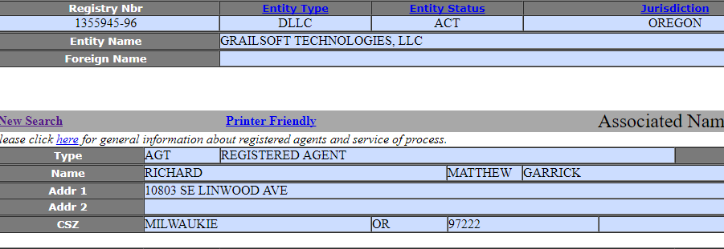
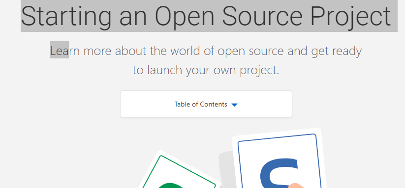
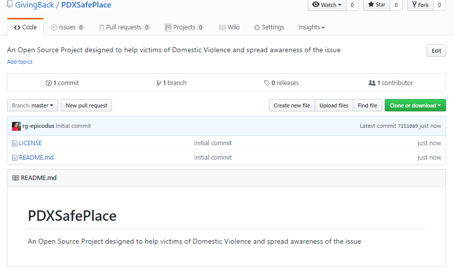
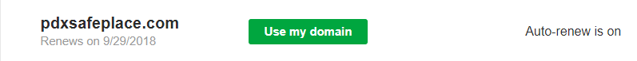
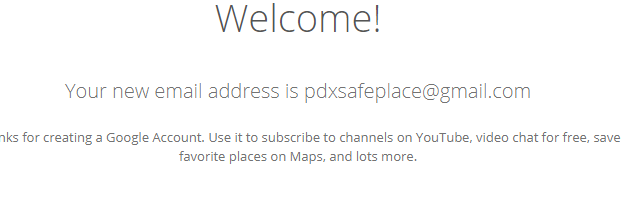
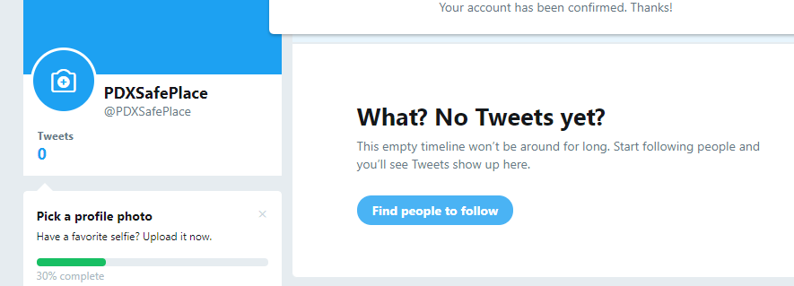

# Repository Information

  Welcome to the repository for the new life cycle. Thank you.

Table of contents
=================

  * [Table of contents](#table-of-contents)
  * [Project Info](#project-info)
    * [Documentation](#documentation)
    * [Adding Collaborators](#add-collaborators)
  * [Installation](#installation)
  * [Specifications](#specifications)
  * [Known Bugs](#known-bugs)
  * [Contributing](#contributing)
  * [License](#license)

### Project Info

  Repository for Information about IAmTheProject

### Documentation

  1.  Made some coffee and had some family development time early when the sun came out.
  2.  Got SoS LLC information collated for new startup
    

  3.  Research starting up open source projects on the web
    

  4.  Start up repo for new  Open Source Project idea
    

  5.  Register new domain for Open Source Project - PDXSafePlace
    

  6.  Register Social Media sites for PDXSafePlace
    
    
    

  7.  Develop placeholder Web Application for PDXSafePlace
    

### Adding Collaborators

  1.  Process Complete, Collaborators hardcoded.

## Installation

Process is required for installation.  Development started 1973 and currently in progress.

## Specifications

| Behavior      | Example Input         | Example Output        |
| ------------- | ------------- | ------------- |
| user enters life | birth | Chaotic whirlwind of amazing experiences |
| user selects early life choices | Good & Bad | User injected into society |
| user selects mid life path | *.omg | Great Opportunities and Difficult Challenges |
| user takes huge risk1-alot | Great Sounding Opportunity | Financial and Emotional Devastation with occasional goodThing |
| user takes anotherRisk | Let's try a new thing | amazingPartner++ |
| user takes anotherRisk2 | New Project Initialized | const amazingChild = initialProject + amazingPartner |
| user makes more choices | lifeChoices = Math.random() | Mostly great things |
| familyUnit takes a huge risk together | risk it all again for new industry entry | Amazing things, great chance to succeed and give back to community|

## Known Bugs

* All bugs known are being worked on at a leisurely pace, unknown bugs will definitely occur and I look forward to learning to squash them.

## Contributing

No contributions are being accepted at this time, thank you for your request.

## License
The Aimee License (AIM)
Copyright 2017 Rich Garrick

Permission is hereby granted, free of charge, to my partner, to deal in this Project without restriction, including without limitation the rights to use, modify, merge with, publish, distribute products of, sublicense, and to permit persons to whom the Software is furnished to do so, subject to the following conditions:

The above copyright notice and this permission notice shall be included in all copies or substantial portions of the Project.

THE PROJECT IS PROVIDED "AS IS", WITHOUT WARRANTY OF ANY KIND, EXPRESS OR IMPLIED, INCLUDING BUT NOT LIMITED TO THE WARRANTIES OF MERCHANTABILITY, FITNESS FOR A PARTICULAR PURPOSE AND NONINFRINGEMENT. IN NO EVENT SHALL THE AUTHORS OR COPYRIGHT HOLDERS BE LIABLE FOR ANY CLAIM, DAMAGES OR OTHER LIABILITY, WHETHER IN AN ACTION OF CONTRACT, TORT OR OTHERWISE, ARISING FROM, OUT OF OR IN CONNECTION WITH THE SOFTWARE OR THE USE OR OTHER DEALINGS IN THE PROJECT.
